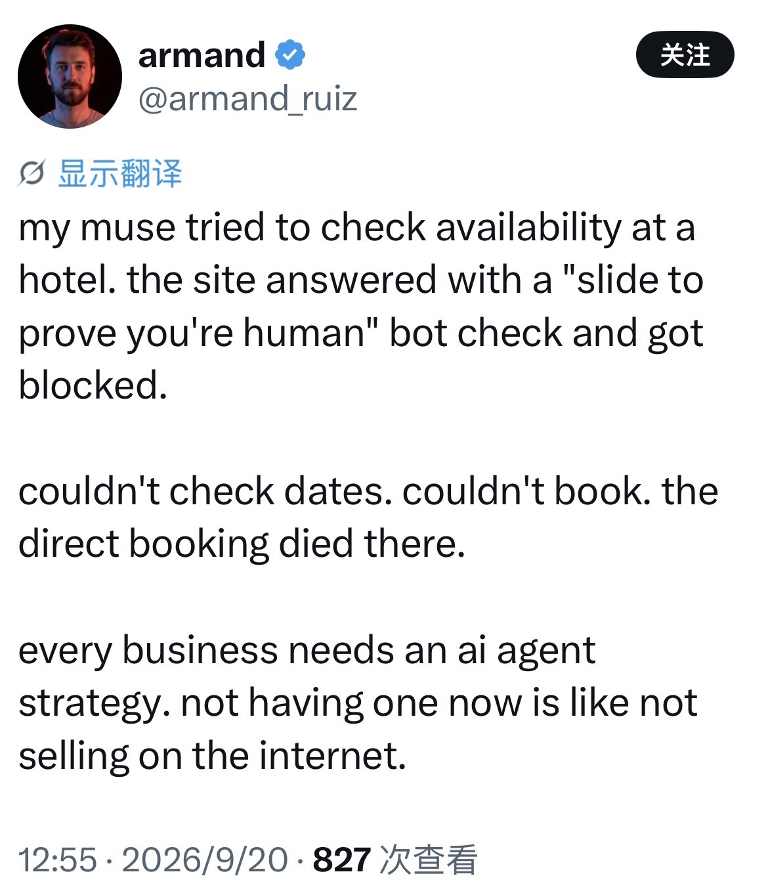
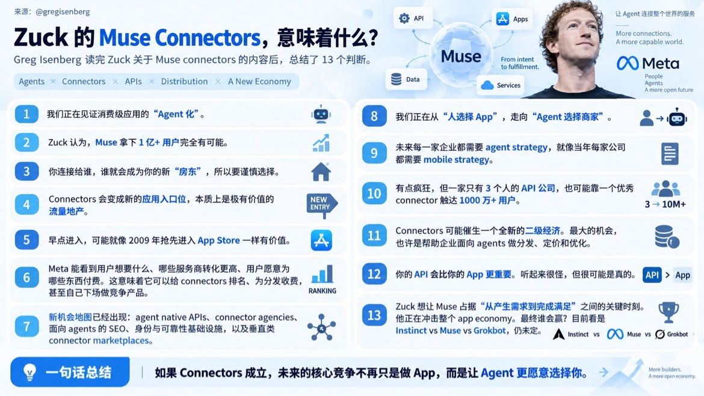

# From SEO to Agent Economy

**Core insight**: When consumers no longer open apps themselves, businesses must take a second kind of digital entrance seriously for the first time: the Agent Interface. Competition used to be about "Rank me" (get people to see me and click in); the Agent era adds a new layer — "Choose me" (give machines a reason to pick me). Humans need to like you. Machines need to trust you.

**Sources**: A discussion with Lao Jia on September 20, 2026, organized by Belinda; Greg Isenberg's 13 takeaways from Zuckerberg on Muse Connectors (X @gregisenberg, Sep 20, 2026); armand (@armand_ruiz)'s tweet about Muse being blocked by a hotel site's CAPTCHA (X, Sep 20, 2026); Meta's public statements on Muse's capabilities (about.fb.com); Google's official documentation on search fundamentals and generative AI Search (Google for Developers)

**New to this topic?** Suggested prerequisites: [Agent](../../glossary.en.md#agent) · [Connector](../../glossary.en.md#connector) · [MCP](../../glossary.en.md#mcp) · [Personal Agents — From Chatbots to an Agent Economy](personal-agents-agent-economy.en.md)

> Framing note: **"Rank me → Choose me"** and **"Brand creates desire. Agent executes intent."** are analytical frameworks proposed in this essay — not established industry conclusions. That is the most precious part of this Learning Wiki: it records not only what the world already knew, but what we saw and where our reasoning landed in September 2026.

---

## Table of Contents

- [Start with an image](#start-with-an-image)
- ["Slide to prove you're human."](#slide-to-prove-youre-human)
- [1. From Human Interface to Agent Interface](#1-from-human-interface-to-agent-interface)
- [2. Connector: the plug through which an Agent reaches the outside world](#2-connector-the-plug-through-which-an-agent-reaches-the-outside-world)
- [3. The App-Only Paradox](#3-the-app-only-paradox)
- [4. Search isn't dying; the Search Interface is changing](#4-search-isnt-dying-the-search-interface-is-changing)
- [5. From "Rank me" to "Choose me"](#5-from-rank-me-to-choose-me)
- [6. What might Agent Optimization optimize?](#6-what-might-agent-optimization-optimize)
- [7. Advertising: what if Agents don't look at ads?](#7-advertising-what-if-agents-dont-look-at-ads)
- [8. Brand won't disappear, but it may split into two faces](#8-brand-wont-disappear-but-it-may-split-into-two-faces)
- [9. Brand creates desire. Agent executes intent.](#9-brand-creates-desire-agent-executes-intent)
- [10. Who owns the real Customer Relationship?](#10-who-owns-the-real-customer-relationship)
- [11. The Agent could even become a privacy buffer for consumers](#11-the-agent-could-even-become-a-privacy-buffer-for-consumers)
- [One final mental model](#one-final-mental-model)

---

## Start with an image

Today I came across Greg Isenberg's summary of Zuckerberg's take on Muse Connectors. One line stood out:

> "We're moving from 'humans choose apps' to 'agents choose merchants.'"

The graphic also argued: Connectors may become the new app entrance, every business will need an Agent Strategy, and APIs may become strategically more important than apps.

I had started out trying to understand a purely technical question:

What exactly is a Connector? How is it different from an API or MCP?

I didn't expect that chasing that one question would lead me all the way into Search, SEO, apps, advertising, Brand, privacy, Trust — and the whole Agent Economy.

And then I saw another, very concrete example…

---

## "Slide to prove you're human."

Someone asked Muse to check room availability on a hotel website. Muse opened the site, ready to complete the task for its user — and the site popped up a verification challenge:

**"Slide to prove you're human."**

The site did nothing wrong. For more than twenty years, internet security has worked hard to distinguish humans from bots. Bots usually mean scrapers, junk traffic, scalpers, attacks, and fraud.

But a new role has now appeared: the **authorized agent** — an AI agent explicitly authorized by a real person, acting on that person's behalf.

And so a security mechanism that was entirely reasonable suddenly produced a paradox: **the site successfully blocked the bot, and may have successfully blocked the customer too.**

That tiny CAPTCHA may not be exposing a product bug. It may be two internet eras colliding.



*Source: armand (@armand_ruiz) on X, September 20, 2026*

---

## 1. From Human Interface to Agent Interface

For decades, business digitalization has rested on one premise: **software is operated by humans.**

In the PC era, businesses built websites. In the mobile era, they built apps. Interfaces grew prettier, buttons smoother, payments easier — because a human sat in front of the screen.

Agents change that premise. When a user tells a Personal Agent:

- "Check whether this hotel has rooms."
- "Buy flowers for my sister's birthday."
- "Find me a MacBook that fits me."

The user no longer cares which app to open, which menu to tap, which form to fill. **The user only expresses intent. The Agent handles the rest.**

For the first time, businesses need to take two different digital entrances seriously:

```
                    BUSINESS
                  /          \
                 /            \
                ↓              ↓
        Human Interface    Agent Interface
                ↓              ↓
          Website / App     API / Connector
                ↓              ↓
              Human           Agent
```

Businesses used to build interfaces mainly for humans; in the Agent era they need to build interfaces for agents too.

The Agent Interface doesn't necessarily have a UI. An Agent needs no pretty buttons, banners, or product displays. It needs **structured, reliable, executable capabilities**:

- What is the product?
- What's the price?
- Is it in stock?
- When will it arrive?
- Can it be refunded?
- What did the user authorize?
- Can it be paid for?
- Did the transaction succeed?

That's why APIs, Connectors, identity, permissions, and structured data are becoming important infrastructure.

---

## 2. Connector: the plug through which an Agent reaches the outside world

Think of a Connector as **the plug through which an Agent reaches the outside world.**

An Agent can understand users, reason, and plan — but the user's email, calendar, hotel inventory, shopping products, and payment systems all live in other services. Connectors plug those external capabilities into the Agent.

A simple mental model:

```
Human
  ↓
Agent
  ↓
Connector
  ↓
API / Service
  ↓
Real World
```

An API is the "door" a service offers to machines. A Connector is how the Agent plugs into and uses that door — authentication, permissions, tool definitions, parameter structures, and returning results. MCP is yet another layer: it tries to **standardize** how Agents communicate with external tools and resources.

So here's a rough way to remember the three: **the API is the door. The Connector is how the Agent plugs into and uses the door. MCP is a standardized connection language everyone's trying to adopt.**

Meta's public statements about Muse already point in this direction: Muse can work across apps on the user's behalf, open web pages in its own browser, fill forms, and complete transactions; the user decides which services to connect and how much permission to grant.

A Connector is therefore not just a technical feature. **It may become the infrastructure of the Agent Economy.**

---

## 3. The App-Only Paradox

In the mobile era, some businesses deliberately weakened or even killed their web experience to push users into their apps. It was rational at the time. Apps helped businesses:

- identify users more reliably;
- build lasting account relationships;
- collect richer behavioral data;
- reach users proactively via push notifications;
- save addresses, payment methods, and purchase history;
- improve retention;
- bypass Google as the entry point;
- keep consumers inside their own ecosystem.

From the consumer's side, the web was free:

```
Search → Open website → Look around → Leave
```

No login required.

From the merchant's side, that freedom sometimes meant exactly this: **the customer could vanish at any moment.** Apps helped businesses turn an anonymous visitor into a long-term user who can be identified, reached, and understood — and who keeps coming back to buy.

Businesses fought hard to get from `Google → Consumer` to `Brand ↔ Consumer`. But the Agent era introduces a new middle layer:

```
Brand ↔ Agent ↔ Consumer
```

Which produces an interesting historical paradox: **yesterday's App moat may become tomorrow's Agent friction.**

If an App-only business has no web access and no machine-facing interface — no API, no Connector — a user-authorized Agent may simply be unable to do business with it. If a competitor can be called by the Agent, transactions will naturally flow to the competitor.

So App-only businesses of the future may not need to rebuild a full web version of their app. What they're really missing may be **a third door: the Agent Interface.**

---

## 4. Search isn't dying; the Search Interface is changing

The traditional search path looks like:

```
Question → Google → Search results → Open several pages → Read → Compare → Synthesize
```

Google's official description of search fundamentals still reads: **Crawling → Indexing → Serving results**. Googlebot discovers pages, Google understands and indexes them, then returns relevant results from the index when a user issues a query. SEO was built around one core goal: **make it easier for the search engine to discover, understand, and surface my content for the right queries.**

But generative AI changed the user's side. More and more questions can now become:

```
Question → AI → Synthesized answer → Follow-up
```

Users haven't stopped searching. They just **run traditional searches themselves less and less.**

Google itself is changing. In 2026, Google's official documentation openly discusses generative AI Search, stating that traditional SEO fundamentals still apply to AI features — and that Google's generative AI search still relies on its core search ranking and quality systems and its search index.

So the more accurate short-term statement isn't "Search is dying." It's: **"Search is being absorbed into AI interfaces."**

---

## 5. From "Rank me" to "Choose me"

In the SEO era, one of the questions businesses cared about most was: **How do I rank higher?** Because a human still made the final choice:

```
Search Engine → 10 results → Human compares → Human chooses
```

The Agent era may produce a different path:

```
Human → Agent → Discover 100 services → Compare → Select 3 → Human
```

Or even, for low-risk, fully-authorized tasks:

```
Human → Agent → Discover → Compare → Choose → Execute → Done
```

The question facing businesses changes: **How do I get the agent to choose me?**

This may give rise to something like Agent Optimization. It isn't necessarily the same as today's SEO, AEO, or GEO — those terms and practices are still evolving fast. But the underlying question is already here: **how do I get machines to discover me, understand me, trust me, and be willing to choose me?**

So competition may add a new goal alongside **"Rank me."**: **"Choose me."**

> (Framework disclaimer: this is not an established industry conclusion; it is this essay's inference, September 2026.)

---

## 6. What might Agent Optimization optimize?

Traditional digital marketing obsesses over presentation: pretty images, headlines, ad copy, promotions, page design. An Agent is, in theory, better at comparing structured variables:

Price · Availability · Specifications · Delivery time · Cancellation policy · Refundability · Reliability · Historical fulfillment · Trust · User preference

So businesses of the future may need to optimize not only "How attractive do we look?" but also **"How trustworthy and executable are we to machines?"**

That means digital competitiveness may gradually gain a new set of metrics:

- API reliability
- structured product data
- machine-readable policies
- transaction success rate
- identity and authorization
- auditability
- fulfillment quality

Businesses used to work hard to **get humans to click on them.** In the future they may also need to **give machines a reason to choose them.**

---

## 7. Advertising: what if Agents don't look at ads?

Traditional digital advertising fights for **human attention.** Search ads need people to notice them in results. Social ads need people to pause in the feed. Display ads need the click.

But an Agent has no "eyeballs." When a Personal Agent hunts for a product on a user's behalf, it won't get excited by "🔥 LAST CHANCE! 40% OFF! 🔥" It's more likely to compare real prices, quality, return policies, and user needs.

Advertising won't simply disappear, but its business model may partly migrate:

```
Attention → Click → Transaction
```

becomes something more direct:

```
Eligibility → Selection → Transaction
```

The relative importance of traditional CPM (pay per impression) and CPC (pay per click) may decline, while CPA, referral fees, commissions, and revenue share — models tied directly to real transactions — may matter more.

We might even see **Ads for Agents.** But that immediately raises a serious Trust problem: if Hotel A pays the Agent platform 5% commission and Hotel B pays 12%, and the Agent recommends B — is it because B suits the user better, or because the platform earns more?

Today, search engines can at least label ads as Sponsored. If an Agent wraps commercial incentives in "this is the best choice for you," the problem is far worse. So the Agent Economy needs not just new advertising models, but new **disclosure, auditability, conflict-of-interest rules, and recommendation transparency.**

---

## 8. Brand won't disappear, but it may split into two faces

Just because ads can't sway Agents easily doesn't mean Brand loses its value. The key is how the user's intent gets formed in the first place.

If the user says "buy me running shoes," the Agent has wide latitude. But if the user says "buy me Nikes," **Nike already won the competition before the Agent showed up.**

```
Brand → Human preference → Intent → Agent → Transaction
```

So in the Agent era, strong brands may matter even more — because competition increasingly happens **before intent is formed.**

On the other hand, highly functional, standardized, easily quantifiable products may feel the impact of Agents most. If the user just needs "a reliable 2-meter USB-C cable, delivered tomorrow, under $20," the Agent can directly compare price, quality, return rates, delivery speed, and reliability. The premium from brand packaging may come under pressure.

So Brand may develop two faces:

```
                     BRAND
                   /       \
                  /         \
                 ↓           ↓
          Human Brand     Machine Brand
                 ↓           ↓
             Emotion      Reliability
             Identity     Trust
             Culture      Data quality
             Story        Fulfillment
             Design       API quality
```

**Humans need to like you. Machines need to trust you.**

---

## 9. Brand creates desire. Agent executes intent.

This may be the most important boundary in today's discussion.

An Agent is great at answering "which hotel suits me best?" But an Agent is probably not what first makes someone feel "I really want to go to Hawaii." That desire may come from a film, a video, a photo, a friend's trip, an article — or the cultural imagination.

So one of Brand's core roles may come back into focus: **creating desire, not just capturing transactions.**

The future division of labor may look like:

```
                    BRAND
                  /       \
                 /         \
                ↓           ↓
        HUMAN INTERFACE   AGENT INTERFACE
                ↓           ↓
             Story         API
             Culture       Connector
             Emotion       Inventory
             Community     Price
             Experience    Policies
             Identity      Transaction
                ↓           ↓
             DESIRE      EXECUTION
                  \       /
                   \     /
                  COMMERCE
```

In one sentence: **Brand creates desire. Agent executes intent.**

That doesn't mean all desire is created by brands, nor that Agents will never shape preferences. It's an analytical framework: human-facing systems are better at shaping meaning, emotion, and desire; agent-facing systems are better at comparing, deciding, and executing.

> (Framework disclaimer: this is not an established industry conclusion; it is a boundary proposed in this essay, September 2026.)

---

## 10. Who owns the real Customer Relationship?

This may be the most important business question of the Agent Economy.

In the Google era, Google held enormous amounts of query intent. In the app era, businesses worked hard to pull users into their own apps and rebuild direct customer relationships.

In the Personal Agent era, the Agent platform may hold all of these at once: **Intent + Context + Memory + Execution.** It knows not just "Maui hotels" but also: three adults, no hiking, no dangerous mountain roads, likes beach walks and good food, travel dates, budget, past hotel preferences — and when the calendar is free.

If all that context ends up pooling in the Personal Agent, control over the gateway to consumers may shift once again:

**The merchant gets the transaction. The Agent gets the relationship.**

So the biggest future competition may not be "who owns the smartest model?" but: **"Who does the human trust to act on their behalf?"**

---

## 11. The Agent could even become a privacy buffer for consumers

In the app era, merchants wanted to know as much as possible about consumers. The Agent era could, in theory, produce a different structure:

```
Merchant:  "What do I need to know about this customer?"
Agent:     "Only what you need to complete this transaction."
```

Users may not need to hand their full behavioral profile to every merchant. The Agent can release only the information required to complete the task. That could make the Personal Agent a kind of **privacy buffer**.

But power doesn't automatically disappear. The question just moves: **how much does the Agent platform itself know?**

So the core infrastructure of the Agent Economy will inevitably have to grapple with: identity, permission, privacy, auditability, controllability, and trust. **Which is why the Agent Economy and AI Trust are not two separate topics.**

---

## What We Know / What Is Emerging / What We Infer

### What We Know — Already Happening

Personal agents have begun moving from "answering questions" to "acting on the user's behalf." Muse's officially described capabilities include working across apps, using a browser, filling forms, booking travel, shopping, and paying; users control which apps to connect and how much permission to grant.

Traditional search still relies on crawling, indexing, and serving, and Google's generative AI Search is still built on its core search ranking, quality systems, and index.

So it would still be an oversimplification to declare "SEO is dead" or "the web is dead." They aren't dead. **But their position in the human-machine interaction chain is changing.**

### What Is Emerging — Taking Shape

Users can increasingly use AI to do what used to require searching, comparing, and opening multiple apps. Businesses are starting to face a question they rarely asked before: **is my service not only human-accessible, but agent-accessible?**

Conflicts between authorized agents and traditional anti-bot infrastructure have already begun to surface.

The importance of APIs, Connectors, agent identity, permissions, machine-readable commerce, and agent payment infrastructure is rising.

### What We Infer — Today's Inferences

If these trends continue:

1. Business digital strategy may expand from Website + App to **Website + App + Agent Interface**.
2. Some App moats may turn into Agent friction.
3. SEO's core competition may gain a new layer: **Rank me → Choose me**.
4. Some of digital advertising's value may shift from human attention to agent selection and transactions.
5. Standardized, quantifiable products may be more easily commoditized by Agents.
6. Brand may gradually hold both a Human Brand and a Machine Reputation.
7. Brand's long-term value may concentrate even more on the stage before intent is formed, while Agents increasingly take over the comparing and executing that comes after.
8. The Personal Agent may become a new trust layer between consumers and digital commerce.
9. Agent platforms that hold Intent + Context + Memory + Execution may become some of the most important gateways of the next internet.

**These are not certain futures. They are hypotheses drawn from technological and behavioral changes already visible today — worth validating over time.**

---

## One final mental model

The internet's core question used to be: **How do I get humans to find me?** The search era's answer was SEO. The mobile era extended it: **How do I get humans into my app and keep them there?**

The Agent era may add a brand-new question: **How do I make agents able and willing to do business with me?**

So the real change may not be as simple as `Website → App → Agent`. More precisely:

```
Human
  ↓
Express intent
  ↓
Personal Agent
  ↓
Discover → Understand → Compare → Choose → Execute
  ↓
Digital services
  ↓
Real-world outcome
```

Search, websites, apps, APIs, and merchants won't disappear because of this. They may increasingly retreat behind the Agent, becoming the infrastructure the Agent calls upon.

AI may not kill Search, apps, and services. **AI is more likely to turn them from "destinations humans operate directly" into the capability layer behind Agents.**

And that slightly funny line from today — "Slide to prove you're human." — may look, in hindsight, like a moment that captured its era.

The old internet is asking: **Are you human?**

The Agentic Internet may need to answer a different question: **Are you an authorized agent acting for a human?**

Between those two sentences lies not a CAPTCHA, but a whole new internet of identity, authorization, trust, distribution, and commerce.

---



*Source: Greg Isenberg's summary of Zuckerberg on Muse Connectors (X @gregisenberg, September 20, 2026) — the discussion trigger for this essay*

## Related Concepts

Agent · Connector · API · MCP · Tool · Workflow · Memory · Trust · SEO · Agent Economy

## Glossary — Connector

**Connector** — the plug through which an Agent reaches the outside world: it connects apps, data sources, or services so the Agent can read information or perform actions within the scope of user authorization.

Simplest mental picture:

```
Agent → Connector → External Service
```

How it differs from its neighbors: **the API is the door a service provides; the Connector is how the Agent plugs into and uses that door; MCP tries to give different Agents and external tools one standardized connection language.**

---

**Last updated**: September 20, 2026

**Related**:
- [Personal Agents — From Chatbots to an Agent Economy](personal-agents-agent-economy.en.md) — The conceptual origin of the Agent Economy: the migration from Attention Economy to Intent Economy
- [Agent Infrastructure as an Operating System](agent-infrastructure-os.en.md) — The Agent OS equivalence theorem: whoever defines the standards and interfaces wins; the Connector is one piece of that infrastructure
- [From "Smartest" to "Most Trustworthy"](capability-to-trust.en.md) — The premise the Agent Economy can't avoid: Trust; "Who does the human trust to act on their behalf?"
- [AI and the Distribution Problem of Economic Abundance](ai-economic-distribution.en.md) — The macroeconomic backdrop to the Agent Economy: who gets the growth
- [Mental Models](../../mental-models.en.md) — Look back over time at how these judgments evolved
