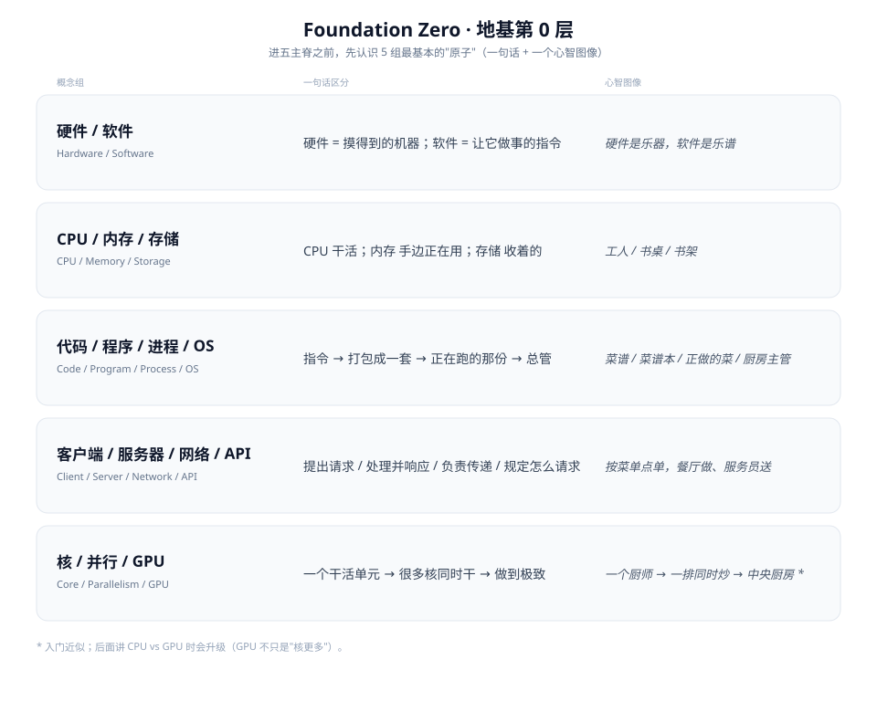

# Foundation Zero · 地基第 0 层

**核心概念**: 进五主脊之前，先认识 5 组最基本的"原子"——每组只需一句话 + 一个心智图像，不是 CS 概论。

---



## 5 组原子

| 概念组 | 一句话区分 | 心智图像 |
|---|---|---|
| 硬件 / 软件 | 硬件 = 摸得到的机器；软件 = 让它做事的指令 | 硬件是乐器，软件是乐谱 |
| CPU / 内存 / 存储 | CPU 干活；内存 手边正在用；存储 收着的 | 工人 / 书桌 / 书架 |
| 代码 / 程序 / 进程 / OS | 指令 → 打包成一套 → 正在跑的那份 → 总管 | 菜谱 / 菜谱本 / 正做的菜 / 厨房主管 |
| 客户端 / 服务器 / 网络 / API | 提出请求 / 处理并响应 / 负责传递 / 规定怎么请求 | 按菜单点单，餐厅做、服务员送 |
| 核 / 并行 / GPU | 一个干活单元 → 很多核同时干 → 做到极致 | 一个厨师 → 一排同时炒 → 中央厨房 * |

\* 入门近似；已经升级，看 [CPU vs GPU：为什么 GPU 赢了深度学习](cpu-vs-gpu.md)（GPU 不只是"核更多"）。

---

## 5 组原子：概念本身

比喻帮助建立直觉，但比喻不是定义。下面把每组拆开，逐个概念给出实际定义（能给例子的都配了例子）。

### 硬件 / 软件

**硬件**

摸得到的物理电路和设备——CPU（Central Processing Unit，中央处理器）芯片、内存条、硬盘、主板、显卡，这些东西即使断电、即使什么程序都不跑，依然实实在在地存在。

**软件**

以指令序列形式存在的程序，规定硬件该做什么。同一台硬件，装不同的软件就能做完全不同的事——这也是为什么"硬件不改变自己能做什么，软件决定这一次具体做什么"。

### CPU / 内存 / 存储

**CPU（Central Processing Unit，中央处理器）**

真正执行指令、做运算的芯片。CPU 每次能做的事很基础（加法、比较大小、跳转到另一条指令……），复杂功能都是由海量这类基础指令组合出来的。

**内存（RAM，Random Access Memory）**

临时存放"当前正在处理"的数据的高速存储。你打开的每个 App、正在编辑的文档，此刻都占用着一块内存——关机或断电，内存里的内容全部清空，这是内存和存储最大的区别。

**存储（硬盘 / SSD，Solid State Drive 固态硬盘）**

长期保存数据的介质。断电不丢失，但读写速度比内存慢得多（尤其是老式机械硬盘）。你保存的文件、安装的 App，不用的时候都躺在存储里，用的时候才被读进内存。

### 代码 / 程序 / 进程 / OS

**代码**

人写的、人可读的指令，比如一行 `print("hello")`。代码本身不能直接运行，需要先经过编译或解释。

**程序**

代码经过编译或打包后、可以被执行的文件，比如你电脑里的 `.exe` 或手机上的一个 App 图标。程序是"静止"的——安装在存储里，没打开的时候不占用 CPU 和内存。

**进程**

程序被加载进内存、实际跑起来之后的那个运行实例。同一份程序可以同时开出多个进程——比如你打开两个独立的浏览器窗口，就是两个进程，各自占用自己的内存和 CPU 时间，互不干扰。

**操作系统（OS，Operating System）**

比如 Windows / macOS / Linux。它管理所有硬件资源（内存该分给谁、CPU 时间该轮到谁），调度所有进程的启动和结束，是软件和硬件之间的总协调者。

### 客户端 / 服务器 / 网络 / API

**客户端**

发起请求的一方，比如你的浏览器、手机 App。

**服务器**

接收请求、处理后返回结果的一方。本质上也是一台计算机，只是常年开着、专门运行某个程序等着响应请求。

**网络**

客户端和服务器之间传输数据的通道，比如互联网、Wi-Fi、局域网。

**API（Application Programming Interface，应用程序接口）**

服务器规定的"请求该怎么写、回复长什么样"的规则。客户端必须照着这个格式来问，服务器才知道怎么答。举个具体例子，假设一个查天气的 API：

```
客户端发出请求：
GET https://api.example.com/weather?city=Shanghai

服务器按 API 规定的格式返回：
{
  "city": "Shanghai",
  "temperature": 28,
  "condition": "多云"
}
```

客户端不需要知道服务器内部怎么算出这个天气数据的，只要按 API 说明书的格式发请求，就能拿到约定好格式的答案——这就是 API 存在的意义：把"怎么问、怎么答"标准化，双方不用了解对方内部实现。

### 核 / 并行 / GPU

**核（core）**

处理器里能独立执行指令的最小单元。一颗 CPU 芯片里通常有 4～16 个核，每个核都能各自执行一条指令流。

**并行**

让多个核同时处理任务，而不是一个核依次排队处理完一件再做下一件。任务能不能并行，取决于这些任务之间是否互相依赖。

**GPU（Graphics Processing Unit，图形处理器）**

核心数量远多于 CPU（可以到几千个），但每个核比 CPU 的核简单得多。靠海量核心同时做简单重复的计算（比如矩阵乘法），在这类任务上比 CPU 快得多——这也是深度学习训练依赖 GPU 的原因。不过这只是入门近似，GPU 和 CPU 的差异不只是"核更多"，细节见 [CPU vs GPU](cpu-vs-gpu.md)。

---

## 下一步

→ [From Silicon to AI：看这 5 组原子如何叠成整体](index.md#from-silicon-to-ai--主定向图)

---

**最后更新**: August 9, 2026

**相关**:
- [Computing Foundations · 计算机基础地图](index.md)
- [Software Map](software-map.md) · [Hardware Map](hardware-map.md) —— 这 5 组原子在 Orient 层被重新摆放、加上新邻居
