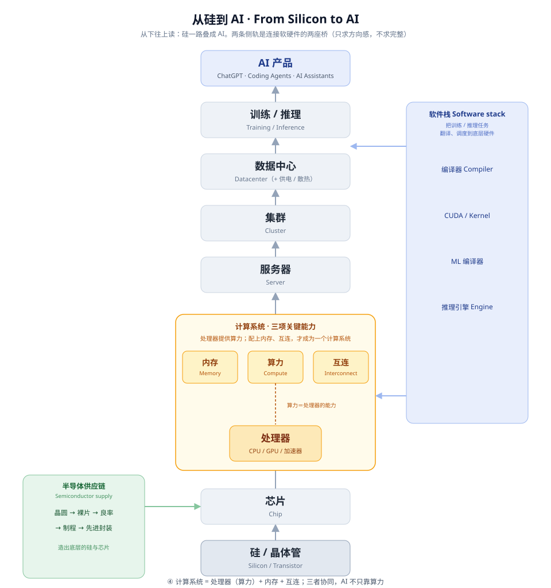

# From Silicon to AI · 从硅到 AI

**核心概念**: AI 不是凭空出现的。你看到的一次模型回答，站在一整条从半导体材料、芯片、计算系统、基础设施、软件栈，到模型与产品的技术栈之上。这篇不重新解释 [Foundation Zero](foundation-zero.md) 已经讲过的原子，只回答一个问题：这些原子怎样一层层连接起来，最后变成今天的 AI？

---

## 先看整张地图



第一次看到这张图，不需要记住里面所有名词。只需要先抓住一件事：

**AI 不是一个孤立的软件模型，而是一整套从物理世界一直延伸到软件产品的技术系统。**

接下来我们只做一件事：从最底下开始，一层一层走到 ChatGPT。

---

## 四层结构

整张地图可以先粗分成四层，每一层只回答一个核心问题：

| 层 | 包括 | 核心问题 |
|---|---|---|
| **01 · 物理基础**<br>Physical Foundation | Silicon、Transistor、半导体制造、Chip | 计算机最底层的物理东西从哪里来？ |
| **02 · 计算系统**<br>Computing System | Processor、Memory、Interconnect、Compute System、Server | 芯片怎样真正变成能够工作的计算机器？ |
| **03 · 基础设施**<br>Infrastructure | Server、Cluster、Data Center、供电、散热、networking | 一台机器不够以后，怎样把大量计算资源组织起来？ |
| **04 · 智能**<br>Intelligence | Model、Training、Inference、AI Product | 底下所有物质、计算和基础设施，最终怎样支撑起 AI 的智能能力并到达用户？ |

**Intelligence（智能）是这张地图的概念终点。** 底层的物质、计算与基础设施，最终支撑起 AI 所表现出来的智能能力。在这张地图里，"智能"不是一个单独的技术组件，而是最上层能力的统称——本层具体涵盖 AI 模型、训练与推理，以及最终面向用户的 AI 产品，例如 ChatGPT、AI 编程助手等。

> **Intelligence 是能力，AI Product 是这种能力最终到达用户的载体。**

这句话很快会在 Step 10 再次用到——先记住这个区分：这里不是在说 Training = Intelligence，而是说 Model、Training、Inference、AI Product 这些技术对象和过程，共同构成了地图最上层的这一整层。

下面沿着主干，从 Silicon 一路走到 AI。

---

## Step 1 · Silicon → Transistor

**为什么一张 AI 地图会从 Silicon 开始？**

Silicon（硅）是现代半导体工业最重要的基础材料之一。通过复杂的制造工艺，可以在高纯度的硅晶圆（wafer）上制造大量晶体管。

**不要**把这个过程想成"沙子直接变成芯片"——从自然界中的含硅材料，到芯片级高纯度硅，中间经过复杂的提纯和制造过程，不是一步到位的。

最重要的心智模型：

> **Transistor（晶体管）≈ 一个极其微小、极其快速、可以控制电流的电子开关。**

这是入门心智模型，不是完整的物理定义——doping、PN 结、MOSFET 这些真实的物理机制，不属于这一页。

## Step 2 · Transistor → Chip

**一个晶体管很简单，为什么几十亿个组合起来就能计算？**

大量晶体管按照特定结构连接起来，可以组成逻辑电路、存储结构和各种计算单元，最终形成一颗 **Chip（芯片）**。

心智模型：**晶体管是基本积木；芯片是用大量积木搭出来的功能系统。**

这里要拆掉一个常见误区：

> **Chip ≠ CPU。**

CPU 是一种芯片，GPU 也是一种芯片，此外还有 memory chip（存储芯片）、networking chip（网络芯片）、其他各类 accelerator（加速器）。

```
Chip
├── CPU
├── GPU
├── Memory Chip
├── Networking Chip
└── 其他 Accelerator
```

不需要深入分类，先建立"芯片是个大家族，CPU/GPU 只是其中两种"这件事就够了。

## Step 3 · Chip → Processor

[Foundation Zero](foundation-zero.md) 已经认识过 CPU 和 GPU——这里第一次知道它们在整张地图中的位置：都属于 **Processor（处理器）** 这一类芯片。

简单区分：

- **CPU**：通用、灵活，擅长复杂控制与各种类型的计算。
- **GPU**：为大量并行计算设计，在 AI 中尤其重要。
- **AI accelerator**：针对特定 AI workload 进一步优化的处理器（比如 TPU）。

不在这里展开 CPU vs GPU 的具体架构差异——完整版见 [CPU vs GPU：为什么 GPU 赢了深度学习](cpu-vs-gpu.md)。

---

## 第一个 Aha Moment：算 / 放 / 搬

到这里为止，很容易形成一个误区：**GPU 越快 = AI 系统越快。** 这一节要拆掉它。

一个真正在工作的计算系统，除了 Processor，还需要两个同样关键的角色：

```
算            放              搬
Processor    Memory    Interconnect
```

**Processor — 算**

负责执行计算。

**Memory — 放**

存放当前计算需要的数据、模型参数和中间结果。这里有一个以后极其重要的区别：

- **Capacity（容量）**：装不装得下。
- **Bandwidth（带宽）**：数据送得够不够快。

容量不够，模型可能装不下；带宽不够，处理器可能花很多时间等数据到来——**这是两件可以独立变化的事，不要把"内存小"和"处理器饿死"混为一谈**。完整版见 [内存墙：为什么很多时候不是算不动，而是数据送不到](memory-wall.md)。

**Interconnect — 搬**

负责不同计算和存储部件之间的数据移动。它不只存在于"GPU 之间"或"服务器之间"，而是在多个尺度上都存在：chip / device 内部、GPU-to-GPU、server-to-server、cluster 之间。这里只需要知道：**计算系统不只是"算"，还必须不停地移动数据。**

核心句：

> **一个 AI 计算系统真正有多强，不只取决于算得多快，还取决于装得下多少，以及数据搬得多快。**

再进一步：**AI 硬件不是单项冠军比赛，而是一个系统工程问题**（这里不用"木桶效应"这个类比来下结论，因为算 / 放 / 搬三者的关系比"最短的那块板"更复杂，具体权衡见 [算力脊](compute-spine.md)、[内存脊](memory-spine.md)）。

## Step 4 · Processor + Memory + Interconnect → Compute System

```
Processor
    +
Memory
    +
Interconnect
    ↓
Compute System
```

**Processor ≠ Computer。** 处理器只是计算系统的一部分。一个真正可以工作的计算系统，还需要 memory、interconnect，以及 storage、供电等其他支持组件——**Processor + Memory + Interconnect 是理解 AI 计算系统时最重要的三个核心维度，而不是对完整计算机组成的穷尽定义**，这一页不展开完整组件清单。

## Step 5 · Compute System → Server

这一步要连接回 [Foundation Zero](foundation-zero.md)。"服务器"其实有两个观察角度：

```
Software view（软件视角）:
Server = 角色 —— 提供服务、响应请求的一方

Infrastructure view（基础设施视角）:
Server = 机器 —— 为长期稳定运行服务和计算任务而设计的计算机
```

两种说法并不矛盾，只是观察层次不同：Foundation Zero 里的 Server 说的是"角色"，这里的 Server 说的是"承载这个角色的物理机器"。

## Step 6 · Server → Cluster

一台服务器已经很强了，为什么还需要 Cluster？因为现代 AI workload 往往太大：一台机器可能装不下、可能算得太慢，训练可能需要大量处理器协作。

> **Cluster（集群）= 一组通过高速网络连接、协同完成计算任务的服务器。**

重要提醒：**1000 台服务器 ≠ 自动获得 1000 倍性能**——因为还需要 communication（通信）、synchronization（同步）、load balancing（负载均衡）、软件层面的协调。这里不展开，完整版见 [从 1 卡到千卡：为什么算力扩展这么难](scaling-and-communication.md)。

## Step 7 · Cluster → Data Center

这一步解决一个常见混淆：Chip / Server / Cluster / Data Center 到底有什么区别？

```
Chip           一个物理计算 / 存储 / 通信器件
  ↓
Server         一台计算机
  ↓
Cluster        协同工作的多台服务器
  ↓
Data Center    容纳、供电、冷却、联网、管理大量服务器和集群的物理基础设施
```

到这里，第一次能看到：**AI 不只是 GPU。** 还需要电力、冷却、网络、机架、物理空间、运维——这里不展开数据中心工程本身。

**为什么 Data Center 也属于 AI 地图？** 因为模型再聪明，也需要芯片、电、冷却、网络、空间、制造能力才能真正运转起来。

> **AI 看起来是软件，但它的规模最终受物理世界约束。**

---

## 两侧支柱

沿着 Silicon → AI Product 这条主干往上走的同时，地图上还有两条一直伴随的支柱——它们不是主干上的某一层，而是让主干真正能运转起来的两套系统。

### 支柱一：半导体供应链（Semiconductor Supply Chain）

图中左下角这一支回答：**这些底层硬件到底怎么被造出来？**

图中把 Wafer、Die、Yield、Process Node、Advanced Packaging 串在一起，是为了标出理解先进芯片制造时最重要的几个概念，**不是一条严格按先后发生的制造工序**（这里的箭头表示概念之间的阅读关系，不等于严格的制造时间顺序——这也是整张 SVG 的阅读原则：它是一张 conceptual map，不是 literal process flowchart）：

- **Wafer（晶圆）**：制造芯片的硅片基础。
- **Die（裸片）**：晶圆加工后切分出的单颗芯片主体。
- **Yield（良率）**：制造出来的 die 中，有多少最终达到可用标准。
- **Process Node（制程节点）**：描述一代半导体制造技术的重要标签，不是某一道制造工序。
- **Advanced Packaging（先进封装）**：把一个或多个 die 与其他组件以高性能方式组合、连接起来的一系列先进封装技术。

这里的目的不是教半导体制造，而是让读者知道：**GPU 背后还有一整套工业供应链**，不是设计图一画完芯片就自动出现了。

现实里可以用几家公司当锚点（注意每家角色不同，不是一家公司覆盖全部环节）：NVIDIA / AMD 负责芯片设计，TSMC（台积电）是代工厂（Foundry），ASML 生产光刻设备，Synopsys / Cadence 提供 EDA（芯片设计软件）。完整版见 [良率与代工：为什么芯片产能约束 AI](yield-and-foundry.md)。

### 支柱二：软件栈（Software Stack）

图中顶部这道弧线，从计算系统一路架到训练/推理（Intelligence），回答：**硬件造出来以后，软件怎么让它真正干活？**

```
AI Application
      ↓
Model / Framework
      ↓
Compiler
      ↓
Kernel / Library
      ↓
Runtime
      ↓
GPU / Accelerator
```

（这条链路和 [Software × Hardware Map](software-hardware-map.md) 用的是同一套站点，这里不重新发明一套新说法。）

心智模型：

> **硬件提供可能性，软件把这种可能性变成实际工作。**

一边负责把机器造出来，另一边负责让机器真正干起来。

这里要拆掉一个误区：**CUDA ≠ driver。** CUDA 是一个更大的软件平台 / 生态，不是某一层的具体机制。完整版见 [CUDA 护城河：为什么软硬之间的决策分散在每一层](cuda-moat.md)。

---

## Step 8 · Hardware → Training / Inference

这是整张地图最重要的一次跨越：从"机器世界"进入"AI 世界"。

先说清楚一件事：**GPU 自己不会"训练 AI"。** 真正发生的是：

```
Model
   +
Data
   +
Training Algorithm
   ↓
Software Stack（翻译成硬件能执行的计算）
   ↓
Hardware 执行计算
```

软件层不断把高层的模型运算，转化成底层硬件能够执行的真实计算。核心只需要记住一句话：

> **AI 模型最终必须变成真实硬件上的真实计算。**

这正是 [Software × Hardware Map](software-hardware-map.md) 想让你带走的东西——这里不重复展开 compiler / kernel 的机制。

## Step 9 · Training vs Inference

**Training（训练）**

> Training = 用数据和优化算法调整模型参数，让模型获得能力的过程。

核心：Training 会改变模型参数。

**Inference（推理）**

> Inference = 使用已经训练好的模型，根据新的输入计算输出。

核心：Inference 通常使用已经学好的参数，而不是重新训练模型。

```
Training
   ↓
Trained Model
   ↓
Inference
   ↓
Answer / Image / Code / Action
```

两边关心的工程问题不完全一样，但**都涉及多个系统变量，不是各自只看一件事**：

- Training 常关心：total compute（总算力）、memory、communication、throughput（吞吐）。
- Inference 常关心：latency（延迟）、throughput、memory、cost。

## Step 10 · AI Product

现在来到地图最上面。

> **Model ≠ Product。**

一个模型要成为 ChatGPT / Claude / Coding Agent 这样的产品，还需要大量其他系统：UI、inference infrastructure（推理基础设施）、orchestration（编排）、tools、memory、safety systems（安全系统）、产品逻辑——这里不展开。

```
Model
    ↓
AI System
    ↓
AI Product
```

核心心智模型：**我们日常接触到的 AI 产品，是整个技术栈最上面、最接近用户的一层。** 呼应前面第四层的区分：**Intelligence 是能力，AI Product 是这种能力最终到达用户的载体。**

---

## 倒着走一次：一句 Prompt 站在什么上面？

这是全文最重要的综合理解测试。假设你在 ChatGPT 里输入一句话：

> 为什么天空是蓝色的？

从产品倒着往下看，站着的是整条技术栈：

```
你输入一句 Prompt
        ↓
AI Product
        ↓
Inference Service
        ↓
Model
        ↓
Software Stack
        ↓
GPU / Accelerator
        ↓
Compute System
        ↓
Server
        ↓
Cluster / Data Center
        ↓
Chips
        ↓
数十亿颗 Transistor
        ↓
Silicon
```

**注意**：这不是一次请求实际执行时严格按顺序发生的 runtime 过程（真实的执行路径要复杂得多，也不会真的"经过硅"这一步）。这是一张 **dependency stack（依赖关系图）**——上面每一层，都依赖下面一层的存在，仅此而已。

---

## 三个核心结论

**1. AI 不只是算法和模型。** 它建立在庞大的物理计算系统之上。

**2. 算力不只等于 Processor / GPU。** AI 系统还受到"算 / 放 / 搬"——也就是 Compute / Memory / Interconnect 共同约束。

**3. 从 Silicon 到 AI，每一层都依赖下一层。** 用户最终看到的只是最上面的产品，下面站着 semiconductor → computing system → infrastructure → software → model → inference。

---

## 毕业自测

不是考试，能用自己的话回答下面这些问题，From Silicon to AI 就算读完了：

1. 为什么 AI 地图会从 Silicon 开始？
2. Transistor 和 Chip 是什么关系？
3. Chip 和 Processor 是同一个概念吗？
4. 为什么 Processor 不能单独组成一个完整计算系统？
5. "算 / 放 / 搬"分别对应什么？
6. Server / Cluster / Data Center 有什么区别？
7. Training 和 Inference 最大的区别是什么？
8. 为什么说 ChatGPT 只是整个技术栈最上面的一层？

---

## 下一步

- ← [Foundation Zero：先认识零件](foundation-zero.md) —— 这篇用到的每个原子，都是那篇先建立的
- → [Software Map](software-map.md) · [Hardware Map](hardware-map.md) · [Software × Hardware Map](software-hardware-map.md) —— 分别进入软件、硬件、两者之间的桥，看更细的邻居关系
- 好奇"为什么"这些层会成为瓶颈 → Go Deeper 五条主脊：[算力脊](compute-spine.md) · [内存脊](memory-spine.md) · [规模脊](scale-spine.md) · [软硬桥脊](bridge-spine.md) · [半导体脊](semiconductor-spine.md)

---

**最后更新**: August 14, 2026

**相关**:
- [Computing Foundations · 计算机基础地图](index.md) —— 这篇是 Start 的必修 02
- [Foundation Zero · 地基第 0 层](foundation-zero.md) —— 必修 01，这篇用到的每个原子的定义起点
- [Software Map](software-map.md) · [Hardware Map](hardware-map.md) · [Software × Hardware Map](software-hardware-map.md) —— Orient 层的三张地图
- [内存墙：为什么很多时候不是算不动，而是数据送不到](memory-wall.md) —— "算 / 放 / 搬"里"放"这一侧的完整展开
- [从 1 卡到千卡：为什么算力扩展这么难](scaling-and-communication.md) —— Cluster 这一步的完整展开
- [良率与代工：为什么芯片产能约束 AI](yield-and-foundry.md) —— 半导体供应链支柱的完整展开
- [CUDA 护城河：为什么软硬之间的决策分散在每一层](cuda-moat.md) —— 软件栈支柱的完整展开
