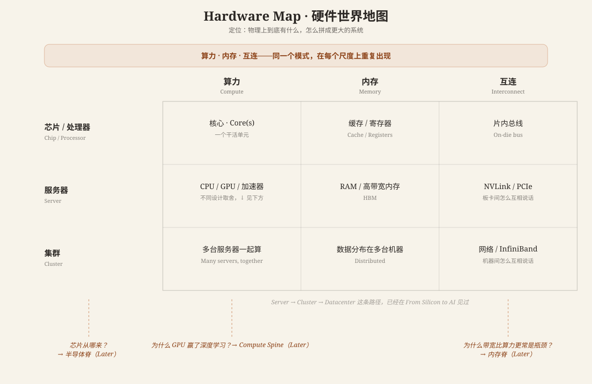

# Hardware Map · 硬件世界地图

**核心概念**: 物理上到底有什么，怎么拼成更大的系统？答案不是一条新的路径要背，而是一个会重复的模式——**算力、内存、互连**这三个维度，在芯片里、在服务器里、在整个集群里，一遍又一遍地出现。看懂一次，就能套用到任何尺度。

---

## 这张图在说什么

[From Silicon to AI](index.md#from-silicon-to-ai--主定向图) 已经画过"硅 → 芯片 → 处理器 → 服务器 → 集群 → 数据中心"这条从头到尾的旅程，那张图的一句话说明是"处理器 + 内存 + 互连 = 计算系统"。这张地图要做的，就是把那一句话变成一个可以随身带走的推理工具：

> **算力、内存、互连——这三样东西，在任何一个尺度上都要问一遍。**

一颗芯片里有：核心（算力）、缓存（内存）、片内总线（互连）。
一台服务器里有：CPU/GPU（算力）、RAM/HBM（内存）、NVLink/PCIe（互连）。
一个集群里有：很多台服务器一起算（算力）、数据分布在各处（内存）、网络/InfiniBand（互连）。

同一个问题，问三次，答案分别在不同的尺度上——这就是这张图想让你带走的唯一一件事。

## 处理器不是只有一种

CPU、GPU、其他加速器（比如 TPU），是**同一个问题（怎么提供算力）的不同设计取舍**，不是越新越好的升级关系。这张图只负责告诉你"存在这些不同的设计"；为什么 GPU 恰好特别适合深度学习，是 [CPU vs GPU](cpu-vs-gpu.md) 这篇已经写好的文章要回答的问题。

同样地，NVLink、InfiniBand、PCIe 都只是"互连"这个概念在不同层级的具体产品名——概念是"东西之间怎么互相说话"，品牌名不用死记。

## 下一步

- → [Software × Hardware Map](software-hardware-map.md) —— 软件怎么把工作实际交给这些硬件
- → [CPU vs GPU：为什么 GPU 赢了深度学习](cpu-vs-gpu.md) —— 处理器变体的第一个案例，已经写好
- 好奇"芯片从哪来" → 半导体脊 Semiconductor Spine（Later，Phase 1+）
- 好奇"为什么内存带宽经常是瓶颈" → 内存脊 Memory Spine（Later，Phase 1+）
- 好奇"为什么扩展到千卡集群很难" → 规模脊 Scale Spine（Later，Phase 1+）

---

**最后更新**: August 9, 2026

**相关**:
- [Computing Foundations · 计算机基础地图](index.md) —— 这张图属于 Orient 层，"处理器+内存+互连"这句话最早在 From Silicon to AI 出现
- [Software Map](software-map.md) —— 硬件世界的邻居
- [Software × Hardware Map](software-hardware-map.md) —— 算力/内存/互连三个词在这里被继续展开
- [CPU vs GPU：为什么 GPU 赢了深度学习](cpu-vs-gpu.md) —— "处理器不止一种"的具体展开
