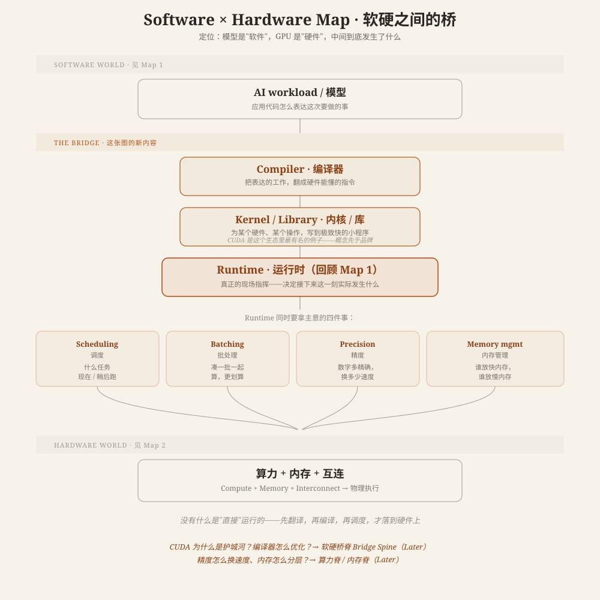

# Software × Hardware Map · 软硬之间的桥

**核心概念**: 模型是"软件"，GPU 是"硬件"——中间到底发生了什么？答案是：**没有什么是直接运行的**。工作先被表达出来，再被编译，再被调度，最后才落到物理硬件上。这张图只标出这条路上的几个站，不深挖任何一站的机制。

---

## 这张图在说什么

这张图是三张地图里唯一一张"横跨"的——上半段用 [Software Map](software-map.md) 已经建立的词汇开场，下半段落在 [Hardware Map](hardware-map.md) 已经建立的词汇上，中间那一段，才是这张图真正要新加的内容。

**上半段（回顾）**：一个 AI workload（模型要做的这次任务）由应用代码表达出来。

**中间（新内容）**：
- **Compiler · 编译器**——把表达出来的工作，翻译成硬件能听懂的指令。
- **Kernel / Library · 内核 / 库**——针对某一种硬件、某一种具体操作，写到极致快的小程序。CUDA 是这一类生态里最有名的例子，但"kernel"是概念，CUDA 只是其中一个实现——先认概念，品牌名随时可以换。
- **Runtime · 运行时**——[Software Map](software-map.md) 里已经认识的那个词，在这里被继续展开：它是真正的"现场指挥"，决定接下来这一刻具体发生什么。

Runtime 同时要拿主意的，不是一件事，是四件并行的事：**Scheduling**（什么任务现在跑、什么稍后跑）、**Batching**（把多个请求凑成一批一起算，更划算）、**Precision**（数字要多精确，换多少速度）、**Memory management**（哪些数据放进快内存，哪些放进慢内存）。这四个词，你会在后面反复遇到——先混个脸熟就够。

**下半段（回顾）**：这些决定，最终交给 [Hardware Map](hardware-map.md) 已经认识的算力、内存、互连去物理执行。

## 为什么这张图重要

- 下次听到"CUDA 是护城河"，知道 CUDA 落在这条链路的哪一站（kernel/编译器生态），而不是一个模糊的专有名词。
- 下次听到"batching"，知道它是 Runtime 要同时权衡的四件事之一，而不是一个孤立的优化技巧。
- 下次听到"量化 / 降精度"，知道它是 Precision 这个决策维度的具体做法。

这张图不解释这些词**为什么**这样设计——那是后面五主脊，尤其是软硬桥脊，要做的事。

## 下一步

- 好奇"CUDA 为什么是一条真正的护城河" → [CUDA 护城河：为什么软硬之间的决策分散在每一层](cuda-moat.md)
- 好奇"精度怎么具体换速度" → [FLOPS 与精度：为什么降精度能提速](flops-and-precision.md)
- 好奇"内存怎么分层管理" → [内存墙：为什么很多时候不是算不动，而是数据送不到](memory-wall.md)

---

**最后更新**: August 9, 2026

**相关**:
- [Computing Foundations · 计算机基础地图](index.md) —— 这张图属于 Orient 层，是三张地图里的"桥"
- [Software Map](software-map.md) —— Runtime 这个词最早在这里出现
- [Hardware Map](hardware-map.md) —— 算力/内存/互连这三个词最早在这里出现
- [FLOPS 与精度：为什么降精度能提速](flops-and-precision.md) —— Precision 这个词在这里被展开
- [内存墙：为什么很多时候不是算不动，而是数据送不到](memory-wall.md) —— Memory management 这个词在这里被展开
- [CUDA 护城河：为什么软硬之间的决策分散在每一层](cuda-moat.md) —— Compiler/Kernel/CUDA 在这里被继续展开
