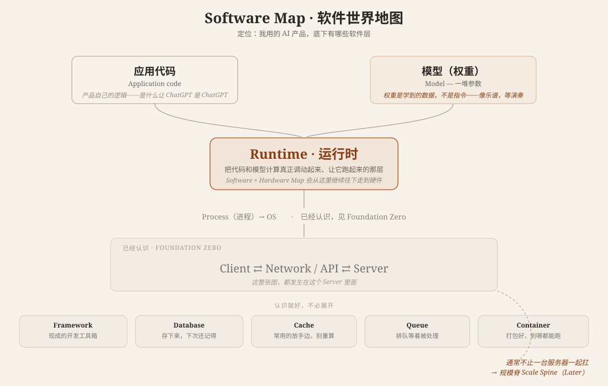

# Software Map · 软件世界地图

**核心概念**: 用 ChatGPT / Claude / Coding Agent 时，看到的东西底下有哪些软件层？这张地图只回答"是什么、大概长在哪、跟邻居什么关系"，不讲"为什么"——想知道为什么，去 Computing Foundations 的 Go Deeper 层，五主脊（见文末"下一步"）。

---

## 这张图在说什么

先认识两个新东西，其余都是已经见过的老朋友。

**1. 模型是数据，不是代码。** 权重（weights）不是一套"指令"，更像一份乐谱——自己不会响，需要有人来演奏。这是从 [Start Here 第 1 站：AI 到底是什么？](../../start-here.md)"模型是引擎、产品是车"往下再深一层：引擎（模型）本身也不是代码，它是数字，得靠别的东西才能跑起来。

**2. Runtime 就是那个"演奏者"。** 不管是要执行一段应用代码，还是要执行一个模型的权重，真正让它"发生"的东西都叫 Runtime——运行时。这张图里，应用代码和模型两条路，最终都汇入 Runtime。记住这个词，[Software × Hardware Map](software-hardware-map.md) 会从这里接着往下走，一路走到 GPU。

Runtime 再往下，是已经在 [Foundation Zero](foundation-zero.md) 认识过的 Process、OS；而这一切，都发生在 Client ⇄ Network/API ⇄ Server 这个已经认识的关系里面——这张图没有重新解释它们，只是把它们摆在了正确的位置上。

## 认识就好的五个词

围着 Server 转的五个概念，只要"见过、知道大概是干嘛的"就够，不需要专门去学：

| 概念 | 一句话 |
|---|---|
| Framework | 现成的开发工具箱，不用什么都从零写 |
| Database | 把东西存下来，下次还能想起来——AI"记得你"，技术上常常靠这个 |
| Cache | 常用的东西放手边，不用每次重新算一遍 |
| Queue | 排队等着被处理，不是所有请求都能立刻办 |
| Container | 打包好一份"能跑起来的环境"，换到哪台机器都一样能跑 |

## 下一步

- → [Hardware Map](hardware-map.md) —— Runtime 最终要在什么物理的东西上执行
- → [Software × Hardware Map](software-hardware-map.md) —— Runtime 具体怎么把工作交给硬件
- 好奇"为什么一个产品通常不止一台服务器" → 规模脊 Scale Spine（Later，Phase 1+）

---

**最后更新**: August 9, 2026

**相关**:
- [Computing Foundations · 计算机基础地图](index.md) —— 这张图属于 Orient 层
- [Foundation Zero · 地基第 0 层](foundation-zero.md) —— Code/Program/Process/OS、Client/Server/Network/API 在这里第一次被认识
- [Hardware Map](hardware-map.md) —— 软件世界的邻居
- [Software × Hardware Map](software-hardware-map.md) —— Runtime 在这里被继续展开
